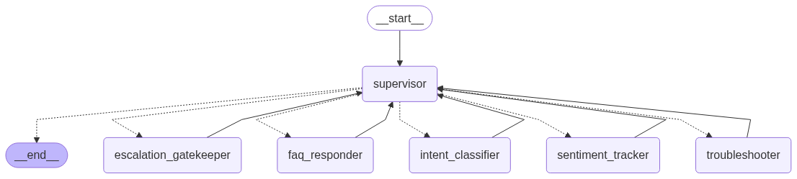
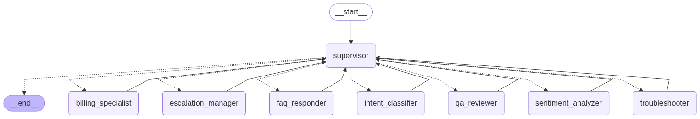

# Langgraph Supervisor Cookbook

This project contains cookbook for the `langgraph-supervisor`. It provides examples and documentation to help users effectively utilize the `langgraph-supervisor` in their projects.

## Overview

This repository contains a collection of Jupyter notebooks that demonstrate the use of the Langgraph-Supervisor framework for building advanced multi-agent systems. The focus is on creating sophisticated, production-style systems that can handle complex tasks through the orchestration of specialized agents.

### Basics

The `basics.ipynb` notebook introduces the fundamental concepts of the Langgraph-Supervisor framework. It includes:

- **Math and Research Experts**: These agents are designed to work together under the supervision of a central controller, ensuring that tasks are delegated to the most appropriate agent.



- **Customer Support Swarm**: A system that utilizes multiple agents to handle customer support tasks.


### Customer Support System

The `customer_support_system.ipynb` notebook showcases a sophisticated multi-agent customer support system. Key features include:

- **Specialized Agents**: The system includes agents for intent classification, FAQ response, troubleshooting, billing, escalation, sentiment analysis, and quality assurance.
- **Supervisor Orchestration**: A central supervisor routes conversations to the appropriate agent, tracks hand-offs, and enforces quality gates.
- **Custom Handover Tools**: These tools carry context, reason, and priority when agents transfer a customer.
- **Rich Toolset**: Includes diagnostics, billing actions, escalation tickets, sentiment analysis, and quality review.
- **Metrics Tracking**: Monitors interactions, escalations, resolutions, and per-agent usage.
- **End-to-End Demonstration**: Features three realistic support scenarios to illustrate the system's capabilities.



## Getting Started

To get started with the `langgraph-supervisor`, you will need to set up your environment and obtain the necessary API keys.

## Setting Up LLM Providers

To use language models with the `langgraph-supervisor`, you can choose from various providers. Below are instructions for setting up OpenRouter and Google. Feel free to add more providers as needed.

### Using OpenRouter

To use OpenRouter, follow these steps to obtain and set up your API key:

1. **Create an API Key:**

   - Visit the [OpenRouter](https://openrouter.ai) to create a new API key.

2. **Set Up Your API Key:**
   - Add to your `.env` file:
   ```bash
   OPENROUTER_API_KEY=<YOUR_API_KEY_HERE>
   ```

### Using Google AI Studio

To use the Gemini API, you need an API key. Follow these steps to obtain your API key:

1. **Create an API Key:**

   - Go to [Google AI Studio](https://ai.google.dev/gemini-api/docs/api-key).
   - Click on "Get a Gemini API key" to create a new API key.

2. **Set Up Your API Key:**
   - Add to your `.env` file:
   ```bash
   GEMINI_API_KEY=<YOUR_API_KEY_HERE>
   ```

### Adding More Providers

If you wish to use other LLM providers, please follow their respective documentation to obtain API keys and set them up in your environment.

## Running with `uv` in VS Code

To run the project with `uv` in VS Code, follow these steps:

1. **Create `uv` virtual environment:**

   - Run the following command to create a virtual environment:
     ```bash
     uv create .venv
     ```

2. **Activate the virtual environment:**

   - Use the following command to activate the virtual environment:
     ```bash
     source .venv/bin/activate
     ```

3. **Synchronize your environment:**

   - Run the following command to add your dependencies:
     ```bash
     uv sync
     ```

4. **Create and Select Kernel in VS Code:**
   - Open the project directory in VS Code.
   - When prompted to select a kernel, choose "Python Environments" and select the virtual environment you created earlier (e.g., `.venv/bin/python` on macOS and Linux, or `.venv\Scripts\python` on Windows).

## Usage

Once you have your API key set up, you can start using the `langgraph-supervisor` by following the examples provided in the Jupyter notebooks.

## Contributing

Contributions are welcome! Please feel free to submit a pull request or open an issue.

## License

This project is licensed under the MIT License.
